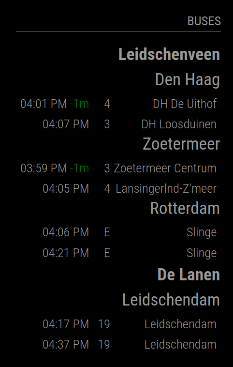

# MMM-NLDepartureTimes

## Introduction

This module shows the departure times of Dutch public transport grouped by stops and destination of choice.

 In this example you see the stops De Lanen and Leidschenveen. Leidschenveen is a LightRail hub that services lines 3,4, E, 19, 30, and N5. The lines interested are grouped to their destination, instead on line number. This way you can quickly see when a vehicle departes to your real destination fo travel.



In the screenshot above I have two stops; Leidschenveen and De Lanen for streetcar 19. The destination is here set to what I tink is relevant for me. For instance, line 3 goes to Den Haag Loosduinen and E goes the Den Haag Centraal. In this example it is relevant for me that they go to Den Haag. So, I grouped them in destination Den Haag. Line 19 is grouped in destination Leidschendam. In this example I only intersted in direction Leidschendam and the other destination Delft is left out this way.

The data used by this module comes by default from [OVapi](https://www.ovapi.nl). OVApi is a semi private project that allows usage by the public.

An alternative source, [DRGL](https://www.drgl.nl), may be used for two reasons:

 * it is quite complex to find out which data to obtain from OVApi;
 * in some cases, the OVApi data is not reliable enough, as stops may be missing or wrong.

## Installation

Clone the repository in the modules directory of MagicMirror:

    cd modules
    git clone https://github.com/Travelbacon/MMM-NLDepartureTimes

Then install this module's dependencies:

  cd MMM-NLDepartureTimes
  npm install

## Updates

To update the module:

  cd MMM-NLDepartureTimes
  git pull
  npm install

## Configuration

To use this module, add the following configuration to your `config/config.js` file.

```javascript
  modules: [
  {
    module: "MMM-NLDepartureTimes",
    position: "top_left",
    header: "Departure Times",
    config: {
      maxVehicles: 5,
      updateSpeed: 10,
      tpc: { .. }, // See below to understand how to set this up.
      drgl: { .. }, // See below to understand how to set this up.
    }
}]
```

These are the generic options:

| Option | Description
|----------|-------------
|`module`   | Module Name. (See [MM Documentation](https://docs.magicmirror.builders/modules/configuration.html))
|`position` | Postion of the module. (See [MM Documentation](https://docs.magicmirror.builders/modules/configuration.html))
|`header`   | Title displayed. (See [MM Documentation](https://docs.magicmirror.builders/modules/configuration.html))
|`maxVehicles` | Number of departure times displayed per destination.<br />**Type:** Integer,**Default:** 4
|`updateSpeed` | refresh time in minutes. Please keep a slow refresh due non commercial property of the API server. See [Github](https://github.com/skywave/KV78Turbo-OVAPI/wiki) of OVapi for etiquette.<br />**Type:** Integer, **Default:** 10
|`source` | Data source name. Supported source: `"ovapi"` and `"drgl"`. See below for more information. <br />**Default:** `"ovapi"`
|`tpc` | Data source configuration when `source` is `"ovapi"`. See below for more information.
|`drgl` | Data source configuration when `source` is `"drgl"`. See below for more information.

## Configure the data source

If you choose the default `"ovapi"` data source, check the [OVApi configuration README](./README.ovapi.config.md).

If you choose the alternative `"drgl"` data source, check the [DRGL configuration README](./README.drgl.config.md).

